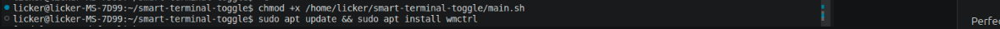
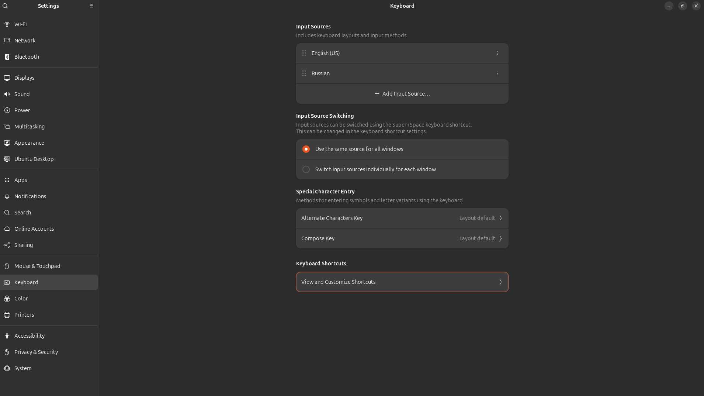
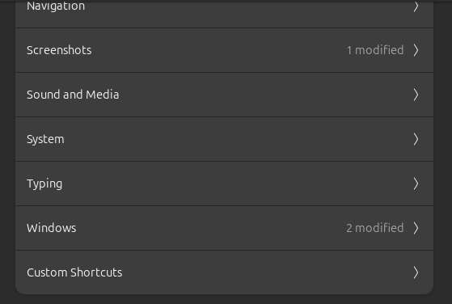
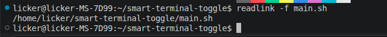
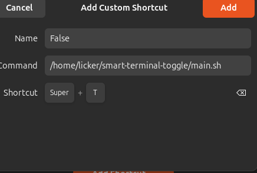
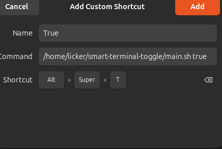

# Smart Terminal Toggle

A lightweight bash script that intelligently toggles GNOME Terminal. Open your terminal with a single hotkey - activate existing windows or launch new ones on demand.

## Features

- **Smart Toggle**: Press a hotkey to activate an existing terminal window or open a new one
- **Force Launch**: Use the `true` parameter to always open a new terminal instance
- **Lightweight**: Simple, efficient bash script with minimal dependencies
- **Easy Setup**: Just a few commands to get started
- **Automatic Terminal Detection**: Automatically finds and uses your installed terminal (Gnome, Kitty, Konsole, etc.), making it compatible with any Linux distro.
## Current Implementation

Currently uses **gnome-terminal** for terminal launching.

**Coming Soon**: Automatic terminal detection - the script will automatically detect and use your default terminal emulator (gnome-terminal, konsole, xfce4-terminal, etc.)

## Requirements

- GNOME Terminal or compatible terminal emulator
- `wmctrl` - window management utility
- Bash shell

## Installation

### 1. Install Dependencies

Update your system and install `wmctrl`:

```bash
sudo apt update && sudo apt install wmctrl
```

### 2. Make Script Executable

```bash
chmod +x /home/licker/smart-terminal-toggle/main.sh
```

### 3. Configure Keyboard Shortcut

Set up a custom hotkey in your desktop environment to trigger the script:

**For GNOME/Ubuntu:**
- Open **Settings** → **Keyboard** → **Custom Shortcuts**
- Add new shortcut with name "Smart Terminal Toggle"
- Set the command to: `/home/licker/smart-terminal-toggle/main.sh`
- Assign your desired hotkey (e.g., `Super+T`, `Ctrl+Alt+T`)

## Usage

### Toggle Terminal (Activate or Open)

Run without parameters:
```bash
./main.sh
```

**Behavior:**
- If a terminal window is already open → activates/brings it to focus
- If no terminal is open → opens a new GNOME Terminal window

### Force Open New Terminal

Run with `true` parameter:
```bash
./main.sh true
```

**Behavior:**
- Always opens a new GNOME Terminal instance, regardless of existing windows

## How It Works

The script uses `wmctrl` to:
1. List all open windows
2. Search for an existing Terminal window
3. Bring it to focus if found, or launch a new one if not

This provides a quick, efficient way to access your terminal without multiple windows.

## Keyboard Shortcut Setup

Once installed, you can bind the script to your favorite hotkey:

```bash
# Example hotkey binding
Super + T (or your chosen key)
```

Then simply press your hotkey to toggle your terminal on and off!

## Screenshots








---
**License: MIT**
**Happy terminal toggling!** 🚀